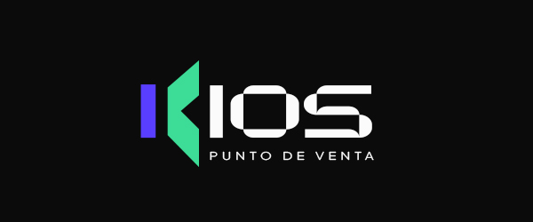

<p align="center">
  
</p>

<p align="center">
  Sistema de punto de venta para kioscos, almacenes y comercios minoristas.
</p>

<p align="center">
  
  
  
  
</p>

---

## Qué es KIOS

KIOS es una versión en **español** de [InfoShop](https://github.com/NifrasUsanar/InfoShop), un sistema de punto de venta de código abierto creado por **Nifras Usanar (Infomax)** y publicado bajo **licencia MIT**.

InfoShop resuelve muy bien la parte funcional —POS, stock por lotes, compras, cuentas corrientes, cheques, sueldos— pero está en inglés y con la estética por defecto de Material UI. KIOS parte de esa base y agrega:

- **Traducción completa al español rioplatense**, con la terminología comercial que se usa acá: *presupuesto* (no "cotización"), *proveedor*, *sucursal*, *saldo*, *vuelto*, *comprobante*.
- **Design system propio**, construido sobre los tokens de [Rayum Lite](https://www.figma.com/community) (Figma, comunidad).
- **Modo claro y oscuro** con selector, contraste verificado según WCAG AA.
- **Datos de prueba de kiosco argentino**: categorías, marcas y productos reales para arrancar.

> KIOS **no** es un proyecto separado ni un reemplazo de InfoShop. Es una adaptación regional. Todo el mérito del sistema base es de sus autores originales.

---

## Requisitos

| | |
|---|---|
| PHP | **8.3 o superior** (8.4 recomendado) |
| Extensiones PHP | `pdo_mysql`, `mbstring`, `openssl`, `tokenizer`, `xml`, `ctype`, `json`, `bcmath`, `gd`, `zip`, `curl`, `fileinfo`, **`sodium`** |
| Base de datos | MySQL 5.7+ / MariaDB 10.4+, o **SQLite** (sin servidor) |
| Node.js | 18 o superior |

> La extensión **`sodium`** es imprescindible: sin ella `composer install` falla al resolver las dependencias de Firebase. En XAMPP viene desactivada — hay que descomentar `extension=sodium` en el `php.ini`.

---

## Instalación

```bash
git clone https://github.com/enzotrib/kios.git
cd kios

composer install
npm install
```

Copiá `.env.install` a `.env` y ajustá los datos de tu base:

```env
APP_URL="http://kios.test"
APP_LOCALE=es
APP_FAKER_LOCALE=es_AR
APP_TIMEZONE="America/Argentina/Buenos_Aires"

DB_DATABASE=kios
DB_USERNAME=root
DB_PASSWORD=
```

Después:

```bash
php artisan key:generate     # imprescindible: no reutilices la clave de la plantilla
php artisan migrate --seed
php artisan storage:link
npm run build
```

### Servir la aplicación

KIOS asume que corre en la **raíz de un dominio**. Genera enlaces absolutos (`/pos`, `/build/...`), así que servirlo desde una subcarpeta (`localhost/kios/public`) devuelve 404 en toda la navegación.

En desarrollo, configurá un VirtualHost apuntando a `public/`:

```apache
<VirtualHost *:80>
    ServerName kios.test
    DocumentRoot "C:/xampp/htdocs/kios/public"
    <Directory "C:/xampp/htdocs/kios/public">
        AllowOverride All
        Require all granted
    </Directory>
</VirtualHost>
```

Y agregá `127.0.0.1 kios.test` al archivo `hosts`. El dominio `.test` está reservado por la RFC 6761 justamente para esto: nunca va a existir en internet.

En **cPanel** no hace falta nada de esto: apuntá el document root del dominio a la carpeta `public/`.

---

## Versión de escritorio

KIOS puede empaquetarse como aplicación de escritorio para Windows, macOS y
Linux con [NativePHP](https://nativephp.com). El paquete incluye su propio PHP
y usa **SQLite**, así que el usuario final no instala ni configura nada: doble
clic y andando.

```bash
php artisan native:run              # desarrollo, abre la ventana
php artisan native:build win x64    # genera el instalador
```

El asistente de instalación se adapta solo: con SQLite no hay servidor de base
de datos que configurar, así que salta ese paso y queda en 4 pantallas, todas
preguntas de negocio (nombre del comercio, sucursal, usuario administrador).

> El mismo código sirve para las dos modalidades. La diferencia son dos líneas
> del `.env`: `DB_CONNECTION=sqlite` para escritorio, `mysql` para la nube.

---

## Datos de prueba

```bash
php artisan db:seed --class=KioscoCollectionsSeeder   # 12 categorías, 58 subcategorías, 83 marcas, 14 etiquetas
php artisan db:seed --class=KioscoProductsSeeder      # 6 productos con lote, stock y precios reales
```

Ambos son idempotentes: se pueden correr varias veces sin duplicar nada.

Los productos incluyen costo y precio distintos (márgenes del 30–36%) para que los reportes de ganancia muestren números con sentido, y uno de ellos tiene stock por debajo del mínimo a propósito, para ver funcionando la alerta del panel.

---

## Comandos útiles

```bash
php artisan user:password --list                 # lista los usuarios
php artisan user:password correo@ejemplo.com     # restablece una contraseña
```

Sirve para el caso típico de "se perdió la clave del administrador", sin tocar la base a mano. En cPanel se corre igual desde la Terminal.

---

## Design system

Los tokens viven en un solo lugar, [`resources/css/app.css`](resources/css/app.css), y los consumen **dos motores**:

```
resources/css/app.css  ← tokens (color, tipografía, radios, espaciado, sombras)
        ├──────────────→ Tailwind v4 / shadcn      (directo)
        └──→ design/theme.js → MUI ThemeProvider   (los lee con getComputedStyle)
```

`theme.js` **lee** las variables CSS en lugar de redefinirlas, así los dos motores no pueden divergir: se cambia un token y cambia toda la aplicación.

**Componentes reutilizables** en `resources/js/Components/design/`:

| Componente | Para qué |
|---|---|
| `PageToolbar` | Barra de acciones con un alto de control único, para que inputs y botones se alineen |
| `SearchField` | Buscador con ícono y placeholder (sin label flotante) |
| `StatPill` | Dato numérico compacto, con tono semántico |
| `StatCard` | Tarjeta de métrica con ícono, valor y variación |
| `SectionHeader` | Título de sección con acciones |
| `Money` | Importes con decimales atenuados y cifras tabulares |
| `ThemeToggle` | Selector de modo claro/oscuro |

Los colores nunca se escriben a mano en los componentes: se elige un **tono semántico** (`primary`, `success`, `warning`, `danger`, `neutral`) y el componente resuelve el token. Así una tarjeta no puede quedar de un color que no pertenezca al sistema.

### Jerarquía de acciones

Una sola acción principal por pantalla. El resto baja de nivel:

| Variante | Uso |
|---|---|
| `contained` | La acción a la que viniste a esta pantalla |
| `outlined` | Acción frecuente pero secundaria |
| `text` | Consultas y navegación, no modifican nada |

---

## Traducción

El sistema usa un helper propio, sin dependencias:

```js
import { t } from '@/i18n';

t('Start Date')  // → 'Fecha de inicio'
```

La **clave es el texto en inglés**, así que cualquier cadena que todavía no esté traducida se muestra en inglés en lugar de romper. Todas las traducciones están en un único archivo editable: [`resources/js/lang/es.json`](resources/js/lang/es.json).

Los mensajes de validación, autenticación y paginación de Laravel están en [`lang/es/`](lang/es), y los textos internos de MUI y del DataGrid usan el locale `esES` oficial.

---

## Módulos

Punto de venta · Ventas · Productos con lotes · Inventario · Compras · Pagos · Gastos · Clientes y proveedores con cuenta corriente · Cheques · Presupuestos · Recargas · Recargos e impuestos · Empleados y sueldos · Sucursales · Reportes · Registro de actividad

---

## Créditos

KIOS está construido sobre **[InfoShop](https://github.com/NifrasUsanar/InfoShop)**, de **Nifras Usanar / Infomax**.

Si usás este proyecto, mantené la atribución al trabajo original:

> Este proyecto está basado en InfoShop, de Infomax / Nifras Usanar.

**Stack:** Laravel 11 · Inertia.js · React 19 · Material UI · Tailwind CSS v4 · MySQL

---

## Licencia

Publicado bajo **licencia MIT**, la misma del proyecto original. Ver [LICENSE](LICENSE).

La licencia MIT permite usar, modificar, distribuir y vender el software, incluso con fines comerciales, con una única condición: **conservar el aviso de copyright y el texto de la licencia**.
